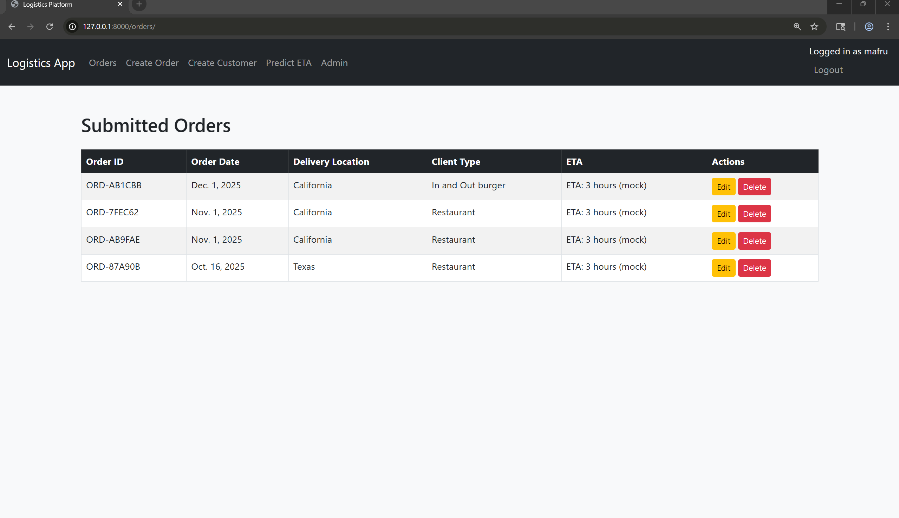
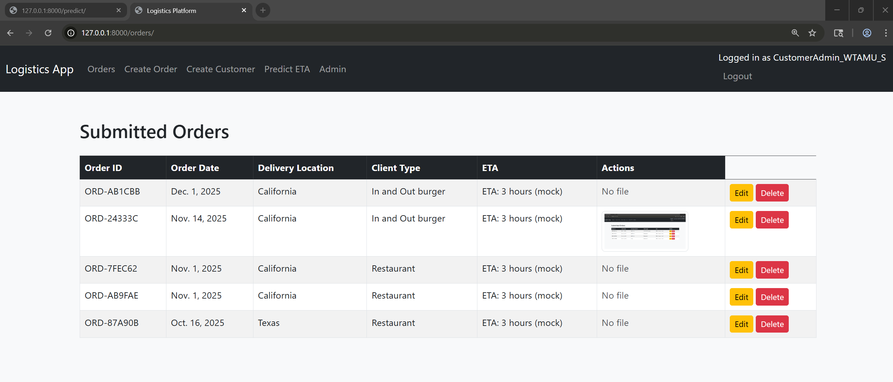
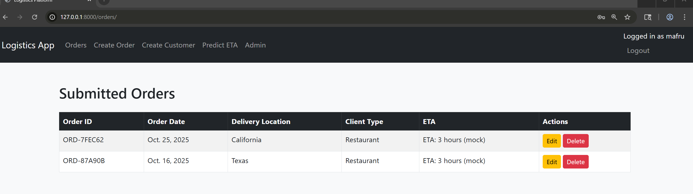
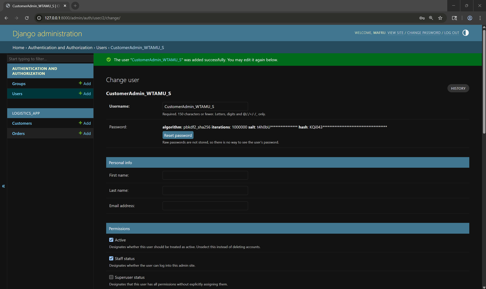
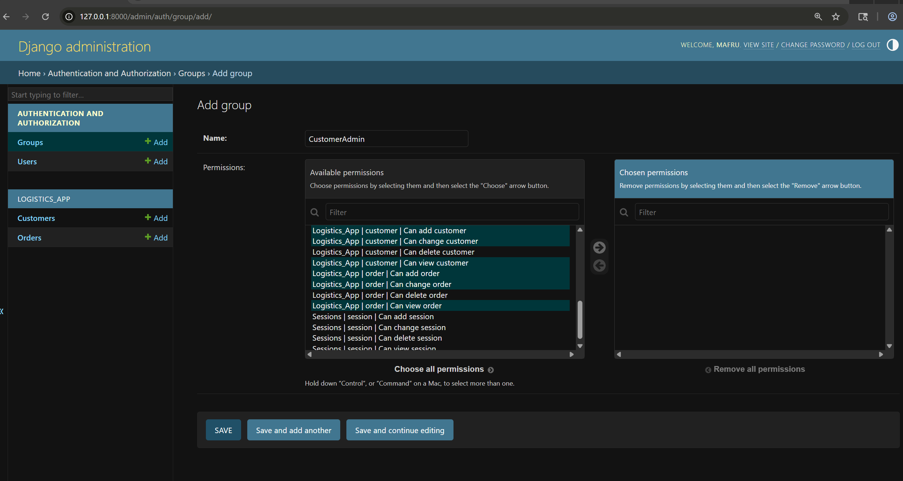
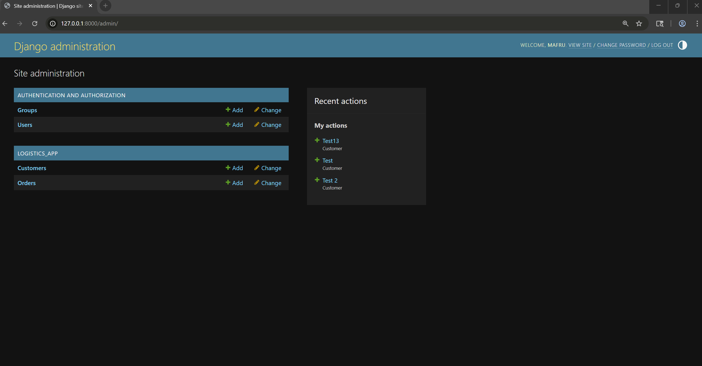

# Module 5 – CIDM 6325: Django Admin + Authentication

**Author:** Mafruha Chowdhury
**Course:** CIDM 6325 – Electronic Commerce (Fall 2025)
**Focus:** Django Admin, Authentication, Role Permissions, File Uploads

---

This module continues directly from the work completed in [Module 4 – Class-Based Views and Application Architecture](https://github.com/Mafruha17/CIDM6325/blob/Module4Assignment/README.md).

## Table of Contents

1. [Overview](#overview)
2. [Part A – Django Admin Implementation](#part-a)
3. [Part B – Authentication + Role-Based Permissions](#part-b)
4. [Part C – Peer Review](#part-c--peer-review)
5. [Part D – Discussion Summary](#part-d--discussion-summary)
6. [Part E – Static and Uploaded Files](#part-e)
7. [Functional vs. Non-Functional Architecture Overview](#functional-vs-non-functional-architecture-overview)
8. [AI Use Disclosure](#ai-use-disclosure)
9. [References](#references)

---

## Overview

This module builds on previous assignments by enhancing the Django Admin experience, implementing user authentication with role-based permissions, and supporting file uploads with image previews.

---

## Part A – Django Admin Implementation

Customized Django admin views for two models:

| Model      | Admin Customizations                                                                                  |
| ---------- | ----------------------------------------------------------------------------------------------------- |
| `Order`    | `list_display`, filters, search, readonly fields, "Mark as Delivered" action, dynamic order form link |
| `Customer` | `list_display`, search fields, order linkage via reverse lookup, ordering, read-only timestamps       |

### Business Use Case

Back-office and customer service roles can:

* Search/filter records
* Perform bulk updates
* View related orders for customers
* Initiate order entry directly from the admin panel

---

## Part B – Authentication + Role-Based Permissions

Implemented Django authentication system using:

* Login/logout integration
* Password policy and superuser/staff creation
* Group-based permissions via Django Admin UI

### User Groups Created

* `CustomerAdmin_WTAMU_S`
* `DataAdmin`
* `DevTestAccounts`

### Permissions Applied

* Orders: View/Add/Delete per group
* Customers: Edit restricted to specific roles
* Login required for admin and CRUD operations

---

## Part C – Peer Review

The peer review requirement for Module 5 builds on my earlier review from Module 4. Since my classmate's repository continued to evolve through the same branch, I validated their enhancements related to admin integration, permissions, and media upload handling.

### Module 5: Peer Review Follow-up

**Reviewed Repository:** [boyhamgirl/CIDM6325_Week7_8_CBV](https://github.com/boyhamgirl/CIDM6325_Week7_8_CBV)
**Files Reviewed:** `blog/views.py`, `templates/post_form.html`, and `admin.py`

**Key Improvements Observed Since Module 4:**

* Admin forms now display inline preview of uploaded media.
* Proper permissions enforced using `PermissionRequiredMixin`.
* Upload path and media handling aligned with Django’s `MEDIA_ROOT` and `MEDIA_URL`.

**Suggestions for Further Improvement:**

* Consider resizing thumbnails in list views using Bootstrap `img-thumbnail`.
* Protect media URLs for unauthenticated users (consider custom view decorators or storage backend configs).

*Reviewed by: Mafruha17*
*Date: November 1, 2025*

---

## Part D – Discussion Summary

This module deepened my understanding of how Django’s admin and authentication systems can serve real organizational roles. Designing for `CustomerAdmin` and `DataAdmin` user groups forced me to think about access boundaries, UX clarity, and business logic enforcement within the platform.

One takeaway was how admin customization (like list filters, custom actions, and related object links) creates real productivity value. Instead of coding everything from scratch, Django's admin scaffolding allowed me to deliver meaningful, usable tools in minutes.

At the same time, enforcing permissions made me realize how difficult it can be to balance security and usability. It’s easy to over-restrict or under-restrict access. The visual feedback of the Django admin helped reveal these tensions early. That kind of visibility helped me iterate and test effectively.

Finally, this project reminded me that user-facing systems don’t end at public pages. Back-office interfaces deserve equal care in terms of structure, flow, and ethical permissions.

---

## Part E – Static and Uploaded Files

### Tech Stack:

* `ImageField` added to `Order` model (`delivery_receipt`)
* Configured `MEDIA_URL` and `MEDIA_ROOT` in `settings.py`
* Enabled upload handling in `order_form.html` using `enctype="multipart/form-data"`
* Confirmed admin and user forms upload to `/media/receipts/`

### Frontend Behavior

* File upload supported in both Create and Edit order views
* Thumbnails rendered using ``
* Conditional preview if file exists

### Figure Placeholders – Insert Screenshot Paths

> All uploads stored in: `/media/receipts/`

---

## Functional vs. Non-Functional Architecture Overview

From a systems architecture perspective, the solution aligns with a clear separation of functional and non-functional responsibilities:

### Functional Behavior

* **Order and Customer Management**: CRUD operations on `Order` and `Customer` models are routed through Django’s URL dispatcher and handled via class-based and function-based views.
* **Dynamic ID Generation**: Order IDs are auto-generated using UUID-based logic within the model layer, ensuring uniqueness without burdening user input.
* **Role-Specific Access Control**: Through group-based permissions (`CustomerAdmin`, `DataAdmin`, etc.), each user’s access path is dynamically filtered by business context.
* **Media Uploads**: Image files (receipts) are stored via Django’s `ImageField` and accessed conditionally during template rendering.

### Non-Functional Behavior

* **Security**: Authentication is enforced across views, with permissions explicitly tied to business logic. CSRF protection, file upload filtering, and permission isolation ensure secure interactions.
* **Scalability & Maintainability**: Admin customization and modular model structure allow for vertical and horizontal scaling (e.g., adding new client types or delivery formats).
* **User Experience**: Use of Bootstrap, error feedback, inline image previews, and admin link injections enhances usability while preserving accessibility.
* **Extensibility**: The app structure (via `logistics_app/`) adheres to Django best practices for pluggable apps, supporting future modular expansion without architectural rework.

---

## AI Use Disclosure

AI tools (ChatGPT-4o) were used for:

* Writing and validating `admin.py`, `forms.py`, `models.py`
* Creating prompt logs and error-handling logic
* Drafting and structuring this README
* Formatting Markdown sections and captions

All AI-generated outputs were reviewed and tested for accuracy.

---

## References

* Layman, M. (2024). *Understand Django*. Chapters 9 & 11
* Django Documentation – [https://docs.djangoproject.com](https://docs.djangoproject.com)
* WTAMU CIDM 6325 Course Materials (Dr. Jeffry Babb, Fall 2025)

---

> Note: Functional and non-functional workflow behaviors (user, order, customer) and links to relevant code files (e.g., `views.py`, `forms.py`, `models.py`) will be explained in the final README iteration or supporting blog post submission.
