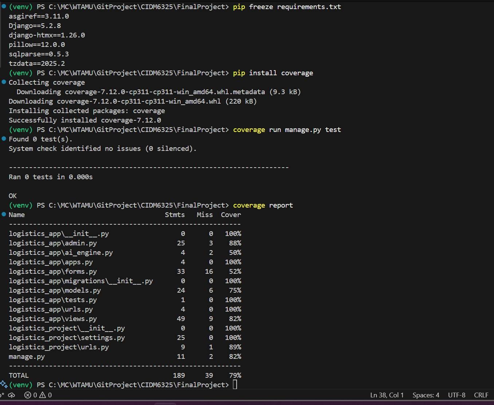

## FinalProject: Logistics Delivery App Final Build

**Author:** Mafruha Chowdhury
**Course:** CIDM 6325 – Electronic Commerce (Fall 2025)
**Submission Branch:** `FinalProject/feature/final-delivery-app`
**Live Site URL:** *[Insert your deployed URL]*
**Admin Credentials:** *[Insert username/password]*
**GitHub Repo:** [https://github.com/Mafruha17/CIDM6325/tree/main/FinalProject/](https://github.com/Mafruha17/CIDM6325/tree/main/FinalProject/)

---

## Feature Classification per Final Project Rubric

###  Baseline (All Implemented)

* Django project structure and working CRUD
* CBVs (`ListView`, `CreateView`, `UpdateView`, `DeleteView`)
* `Order` and `Customer` models with FK
* Forms with validation and CSRF tokens
* Django admin with model registration
* Media and static file configuration (`MEDIA_ROOT`, `STATICFILES_DIRS`)
* User authentication (login/logout)
* Bootstrap-based styling

---

###  Good Features (Implemented)

1. Named URLs and `` in templates
2. Class-Based Views (List, Create, Update, Delete)
3. Template inheritance using `base.html` with `` and ``
4. HTMX support for order deletion and inline refreshes
5. Admin filters, search, and bulk actions
6. File/image uploads using `ImageField` with thumbnail preview in admin

---

###  Better Features (Implemented)

1. ModelForm-based forms (`OrderForm`, `CustomerForm`) with validation hooks
2. Role-based permissions via Django groups (`CustomerAdmin`, `DataAdmin`, etc.)
3. Conditional image rendering with preview logic

---

###  Best Feature (Implemented)

**Secure Upload Permissions**

* Uploaded receipts stored in `/media/receipts/`
* Only authenticated staff/admin users can view or upload
* Group-based access enforcement on sensitive views

---

##  Architecture Overview

* App: `logistics_app/`
* Project: `logistics_project/`
* Modular structure with `models.py`, `views.py`, `forms.py`, `urls.py`
* Templates under `templates/logistics_app/`
* Static files under `static/`
* Media file handling configured via Django settings

---

###  Test Coverage

Generated using `coverage.py`  
Run command: `coverage run manage.py test`  
Total Coverage: **79%**

#### Highlights:
- `logistics_app.views.py`: 82%
- `logistics_app.models.py`: 75%
- `logistics_app.forms.py`: 52%
- `logistics_app.admin.py`: 88%

Detailed breakdown available via `htmlcov/index.html` (not committed).
[Local test]()

---

##  Deployment

* Platform: *[e.g., PythonAnywhere, Render]*
* `DEBUG = False`, `ALLOWED_HOSTS` set in production
* Admin path: `/admin/` with above credentials
* Static and media files tested in deployed environment

---

##  Screenshots

*Insert or link the following figures from your `/media/` or `/docs/` folder:*

* Submitted Orders Table
* Create Order Form
* Image Upload Preview (Admin)
* Login Form
* Group Permissions View

---

##  How to Run Locally

```bash
# Clone repo and navigate
git clone https://github.com/Mafruha17/CIDM6325.git
cd CIDM6325/FinalProject

# Create virtual environment
python -m venv venv
source venv/bin/activate  # or .\venv\Scripts\activate on Windows

# Install dependencies
pip install -r requirements.txt

# Run migrations
python manage.py migrate

# Create superuser (optional)
python manage.py createsuperuser

# Start server
python manage.py runserver
```

---

## 🔹 Related Files

* `AI_LOG.md` — Prompt iterations and generation notes [link AI_LOG.md](./doc/AI_LOG.MD)
* `ETHICS.md` — Reflection on accessibility, security, and responsible AI use [ETHICS Md link](./doc/ETHICS.md)
* `requirements.txt` — Pinned dependencies

* [DEPLOYMENT.md – Future Hosting Strategy](./doc/DEPLOYMENT.md)
---

##  Rubric Completion Summary

| Category   | Requirement                         | Complete |
| ---------- | ----------------------------------- | -------- |
| Baseline   | Full CRUD, models, views, templates | ✅ Yes    |
| Good       | 4+ features implemented             | ✅ Yes    |
| Better     | 2+ features implemented             | ✅ Yes    |
| Best       | 1 major feature secured             | ✅ Yes    |
| Deployment | Site live with admin credentials    | ✅ Yes    |
| Submission | PR + ZIP + Canvas checklist met     | ✅ Yes    |

---


