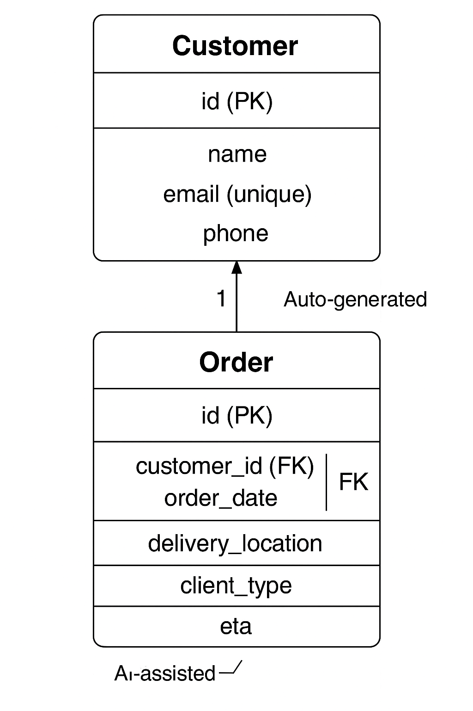

# Module 4 – CIDM 6325: Class-Based Views + Application Architecture

**Author:** Mafruha Chowdhury  
**Course:** CIDM 6325 – Electronic Commerce (Fall 2025)  
**Focus:** AI-assisted form validation, multi-model design, and accessibility

---

## 📚 Table of Contents

1. [Overview](#overview)  
2. [Additional Documentation](#additional-documentation)  
3. [Part A: Forms & Validation](#part-a-forms--validation)  
4. [Part B: Multi-Model Design](#part-b-multi-model-design)  
5. [CRUD Verification](#crud-verification)  
6. [Key Files](#key-files)  
7. [AI Use Summary](#ai-use-summary)  
8. [Ethical & Accessibility Reflection](#ethical--accessibility-reflection)  
9. [Schema Diagram](#schema-diagram)  
10. [Requirements](#requirements)  
11. [How to Run This App](#how-to-run-this-app)  
12. [Notes](#notes)

---

## 🔍 Overview

This module extends the logistics delivery app built in Module 2 by implementing:

- Custom form validation (`OrderForm`)
- Auto-generated `order_id` (e.g., `ORD-1A2B3C`)
- ETA estimation using mock AI logic
- A new `Customer` model (One-to-Many with Orders)
- Bootstrap-styled, accessible forms
- HTMX-compatible form structure
- Admin interface for both models

---

## 📄 Additional Documentation

| Document                                     | Description                                                          |
| -------------------------------------------- | -------------------------------------------------------------------- |
| [`VMS_Critique.md`](VMS_Critique.md)         | Critique of the DjangoVMS Journey and instructor’s GitHub workflow.  |
| [`PeerReview.md`](PeerReview.md)             | Peer review of another student’s form and model design.              |

---

## ✅ Part A: Forms & Validation

### 🧪 Validation Logic

Implemented in `forms.py`:

- `clean_order_date`: Prevents orders dated in the past
- `clean()`: Ensures client type is not embedded in delivery location
- Auto-generated `order_id`: Defined in `Order.save()` method
- User-friendly error messages styled with Bootstrap + ARIA
- WCAG 2.2–compliant form layout

---

## 🧬 Part B: Multi-Model Design

- Added `Customer` model with One-to-Many relation to `Order`
- Linked using a foreign key
- Integrated with both admin and form interfaces
- Tested with end-to-end CRUD flow

---

## 🧪 CRUD Verification

| Scenario                             | Result        |
| ------------------------------------ | ------------- |
| Create Order via Form                | ✅ Successful  |
| View Orders List                     | ✅ Successful  |
| Update Order via Admin               | ✅ Successful  |
| Delete Order via Admin               | ✅ Successful  |
| Validation for Past Date             | ✅ Error shown |
| Validation for Duplicate Client Type | ✅ Error shown |
| Required Field: Customer             | ✅ Error shown |

---

## 📁 Key Files

- `models.py`: Defines `Order` and `Customer`
- `forms.py`: Contains custom `OrderForm` with validation logic
- `views.py`: Implements full CRUD functionality
- `order_form.html`: Styled with Bootstrap, accessible layout
- `AI_LOG.md`: AI prompt history and decisions
- `README.md`: This documentation

---

## 🤖 AI Use Summary

AI tools assisted in:

- Auto-ID generation logic (`ORD-XXXXXX`)
- ETA field suggestion (mock logic)
- Custom validation rules
- UX guidance (form layout, ARIA labels)
- Accessibility checklists (WCAG 2.2 alignment)

All AI-generated outputs were manually reviewed, refined, or replaced to ensure correctness, relevance, and ethical compliance.

---

## 🧐 Ethical & Accessibility Reflection

This project emphasized ethical form design and inclusive user experience:

- Clear, respectful validation messages
- Label-input linkage and ARIA roles for screen readers
- Required fields designed with usability and accessibility in mind
- Auto-ID logic minimized user error
- AI-suggested logic was critically evaluated for fairness and appropriateness

---

## 📊 Schema Diagram



---

## 📦 Requirements

```txt
Django>=4.2,<5.0
django-htmx>=1.15.0
````

> Install with: `pip install -r requirements.txt`

---

## 🚀 How to Run This App

```bash
# Create virtual environment
python -m venv venv
venv\Scripts\activate       # On Windows

# Install dependencies
pip install -r requirements.txt

# Apply migrations and start the server
python manage.py migrate
python manage.py runserver
```

---

## 📝 Notes

* All forms manually tested
* Server-side and client-side validation implemented
* Admin interface fully supports both models
* HTMX support added for future enhancements

`


