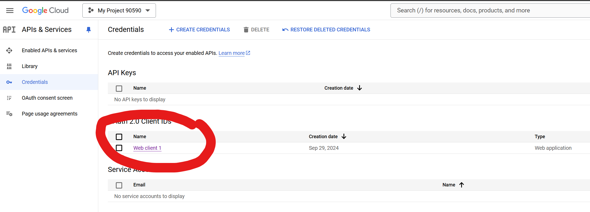

# CIDM6325 - Fall 2024 #
README Outline:
- Chapters 1-3 build the blog
- Chapters 4-7 build the bookmarks social website

## Video Notes ##
- Technical Notes CH 2 - 7
    - Docker - Part 1
    - Emails and Email Backends - Part 2
    - Docker and Postgres - Part 3
    - Social SSO - Part 4
- Methods to implement Recipe (ch 1 - 3)
- Working with Bootstrap

## SendGrid and Anymail ##
Steps from https://anymail.dev/en/v12.0/esps/sendgrid/
1. `pip install "django-anymail[sendgrid]"`
2. add `anymail` to INSTALLED_APPS

[back to outline](#cidm6325---fall-2024)

## Docker Stuff ##
WSL2 is probably the best option for Windows.


You can use the shell from within the Docker Interface


Or, if on Windows, use PowerShell. If on Mac, Terminal is fine.


docker run --name=blog_db2 -e POSRGRES_DB=blog -e POSTGRES_USER=blog -e POSTGRES_PASSWORD=xxxxx -p 5432:5432 -d postgres:latest


steps:
1. `docker pull postgres` - I left the version off, so it gets the latest
2. `docker run --name=blog_db -e POSRGRES_DB=blog -e POSTGRES_USER=blog -e POSTGRES_PASSWORD=password -p 5432:5432 -d postgres:latest` - note, you will realize the best results if you just stick to what Antonio is showing.
3. Although running `pip install psycopg` is a safe approach, it may not work entirely when doing a Docker container with Postgres, this mainly due to Postgres being virtualized where none of the resources used by Postgres are actually on your local system (Docker is). Your likely error message here will be "psycopg or psycopg2 not installed/found."
4. So, in case of issues with step 3 above, try this: `pip install "psycopg[binary]"` - this is recommended in the [psycopg documentation](https://www.psycopg.org/psycopg3/docs/basic/install.html#binary-installation).
5. Its also possible to rent a Postgres server from a number of places such as Digital Ocean.
6. The best way to see if all of this goes well is to run `python manage.py check` - this checks to see if Django will properly "bootstrap" itself to life. A good resposne is "System check identified no issues (0 silenced)."
7. `dumpdata` and `loaddata` may have failed depending on whether you followed the book exactly. Not a huge deal in development.
8. You can run/pause/stop the Postgres Docker container using the desktop application.

## Social Auth Notes ##
Clearly, the screens at the Developer Console for Google's Cloud Services are slightly different than the book.  However, the screens are similar.

Other notes:
1. It is CRITICAL that, in Windows, the hosts file is edited with a text editor that is started with evelated permissions  (right click and "Run as Administrator")
2. the Client ID from the "Client ID for Web Application" screen is the GOOGLE_OAUTH2_KEY
3. the Client secrete from from the "Client ID for Web Application" is the GOOGLE_OAUTH2_SECRET
4. django social auth is doing the rest of the "magic"

### Google Cloud: ###
1. The URL for the overall cloud developer console is: [Google Cloud Console](https://console.cloud.google.com/)
2. A new project screen: 
3. Select your project: 
4. Select OAuth Consent screen: 
5. Enter App Info (name and Authorized Domains): 
6. Add Test User (must be the email you want to social auth with): 
7. Create Credentials (dropdown shown and different from book): 
8. Create OAuth Cliend ID - Application Type "Web Application"; Add Authorized JavaScript Origings: Add Authorized redirect URIs: 
9. Results Dialog - all info needed are on results diaglog: 
10. Credentials Dashboard - 
11. Credentials Summary - 

## Celery Command in Python ##
1. On Windows, you will likely need to run a separate Git-Bash session with administrative rights (right-click and "Run as Administrator")
2. If not you will likely get this error `[WinError 5] Access Is Denied`, however, that is not the only source of this error on windows.

Let's look further into this:
1. For now, don't run Celery within VS Code (on windows) until I find a VS Code setting for you.
2. You WILL need to activiate the virtual environment in this new (separate) Git-Bash or PowerShell terminal
3. You will also want to limit the number of concurrent worker to something small for our testing purposes.  
4. Lastly, Windows has a hard time spawning new subprocesses and will utilizately thrlow the Access Denied error.
5. Although not mentioned in the book (because Antonio is likely developing on a Mac), we can use a Python "coroutine" trick using the [gevent](https://pypi.org/project/gevent/) package `pip install gevent` which utilizes greenlet to "fake" Python into using a single process as threads or coroutines. After installing `gevent` we can move on (as far as I can tell, this is Windows stuff).
6. So, try adjusting the command to the following: `celery -A myshop worker --loglevel=INFO --concurrency=4 -P gevent` and you should achieve success where the errors disappear.

You will be left with output that looks like the book, but the outlet is on the SEPARATE "Run As Admin" window.

```
pip install gevent

celery -A myproject worker --loglevel=info -P gevent
```

In the end, sending an email via a message queue like celery and RabbitMQ is going to be a "nice to have" feature in the project.

## General Notes ##
- we eventually start running the Django debug server wit this command: `python manage.py runserver_plus --cert-file cert.crt`
- [The Django Secret Key Generator](https://django-secret-key-generator.netlify.app/) - [Source Code for the curious](https://github.com/RealOrangeOne/django-secret-key-generator) - you need this because the default secret key is not meant for deployment.
- Commands to run when checking for outdated packages in your Virtual Environment (VE):
    * Be sure that your VE is activated (`source .venv/Scripts/activate`)
    * check for outdated packages `python -m pip --outdated`
    * update package(s) as appropriate `python -m pip install --upgrade <name-of-package>`

- In addition to the book, this is a good resource: [W3Schools Django](https://www.w3schools.com/django/index.php)
- A [Git Cheat Sheet](https://training.github.com/downloads/github-git-cheat-sheet/) is available as a quick reference for common `git` commands.
- Boostrap Crash Course (freecodecamp): [Full Bootstrap 5 Tutorial for Beginners](https://www.freecodecamp.org/news/full-bootstrap-5-tutorial-for-beginners/)

[back to outline](#cidm6325---fall-2024)

## Miscellaneous Notes ##
- **Templates and Bootstrap** - I will strongly recommend that you use and develop familiarity with [Bootstrap](https://getbootstrap.com/) as a CSS framework for all of your work in this class.
- **Classy Class-Based Views** - Should you wish to go in this direction: [https://ccbv.co.uk/](https://ccbv.co.uk/)
- **Environment Variables** - I have used [python-dotenv](https://pypi.org/project/python-dotenv/) forever and have done so in my code - Antonio uses [python-decouple](https://pypi.org/project/python-decouple/).
- **Candidate Heroku Replacements** - Heroku used to be the best free Django deployment platform - it is no longer free.  Here are some replacement services.
    * render.io
    * python anywhere
    * Fly.io
    * [Railway](https://railway.app/)

This README file is constructed using [MarkDown](https://www.markdownguide.org/basic-syntax).  Here is another good [Markdown reference](https://commonmark.org/help/).

[back to outline](#cidm6325---fall-2024)
